RealSim CarMaker Documentation
=======================
Please start with reading through the documentation, and playwith included Examples.

Contacts
=======================
Yunli Shao\
realsimxil@gmail.com

Table of Contents
=======================
* [Simulation Setups](#simulation-setups)
    * [Setup CM Office or Simulink](#setup-cm-office-or-simulink)
        * [Obtain CarMaker Executables](#obtain-carmaker-executables)
        * [Compile Source Codes ](#compile-source-codes)
    * [Setup CM dSPACE](#setup-cm-dspace)
        * [Obtain dSPACE library](#obtain-dspace-library)
        * [Compile dSPACE library](#compile-dspace-library)
        * [Prepare User.c](#prepare-userc)
	* [Prepare for dSPACE build (configuration desk)](#prepare-for-dspace-build-configuration-desk)
 		* [Additional instructions for RS Simulink libraries](#additional-instructions-for-rs-simulink-libraries) 

* [Setup Application](#setup-application)
    * [SUMO](#sumo)
* [Run Simulations](#run-simulations)
    * [General Setups](#general-setups)
    * [Office](#office)
    * [Simulink](#simulink)
    * [dSPACE](#dspace)
* [Examples](#examples)
    * [dSPACE Simulation](#dspace-simulation)

<!--    * [Office Simulation](#office-simulation)
    * [Simulink Simulation](#simulink-simulation)
-->

# Simulation Setups

## Setup CM Office or Simulink

### Obtain CarMaker Executables
RealSim contained compiled CarMaker executables, i.e., CarMaker.win64.exe for Office version, and libcarmaker4sl.mexw64 for Simulink version. Three different versions are supported, CarMaker 11, 10 and 9. Users can directly use these executables without need to recompile source codes. The executables are inside the corresponding folders ```CM11```, ```CM10```, ```CM9```.

Another option is that users can modify the CarMaker User.cpp by themselves and include necessary source codes of RealSim. Corresponding Visual Studio project files are provided and users can use their own IDE as well. 

### Compile Source Codes
For both Office and Simulink, need to make sure compiler/IDE include the followings:
- source files (in \CommonLib folder)
    
    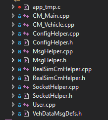
- dependencies folders
    
    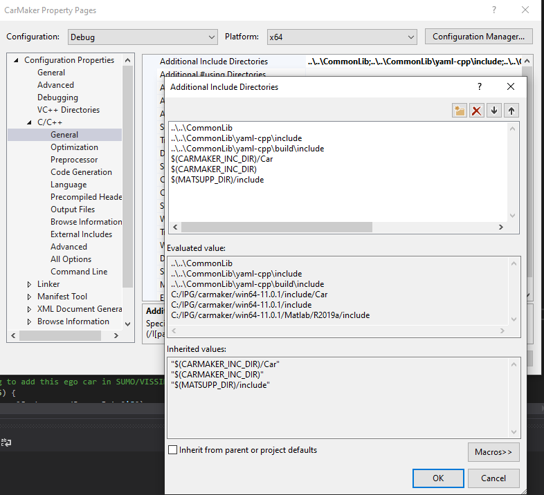  
- libraries
    
    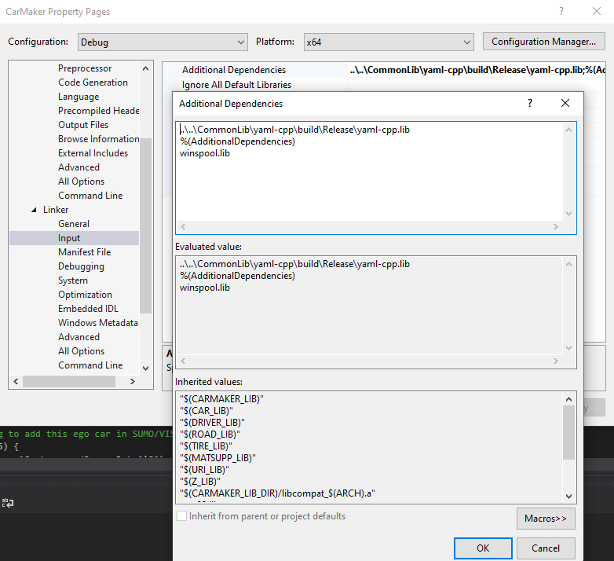

Then, modify the User.cpp to include the following codes
- at beginning of the file, add the followings, ``need to make sure RealSimCmHelper.h is included before including the windows.h!``
```cpp
...
#include <Global.h>

// ===========================================================================
// 			 RealSim 
// ===========================================================================
#include "RealSimCmHelper.h"

RealSimCmHelper RealSimCm_c;
// ===========================================================================
// ===========================================================================

#if defined(WIN32)
# include <windows.h>
#endif
...
```

- modify the User_ScanCmdLine
```cpp
char **
User_ScanCmdLine (int argc, char **argv)
{
    const char *Pgm = argv[0];

    /* I/O configuration to be used in case no configuration was
       specified on the command line. */
    IO_SelectDefault("default" /* or "demoapp", "demorbs,demofr" etc. */);

    while (*++argv) {
	if (strcmp(*argv, "-io") == 0 && argv[1] != NULL) {
	    if (IO_Select(*++argv) != 0)
		return NULL;
	} 
    else if (strcmp(*argv, "-h") == 0 || strcmp(*argv, "-help") == 0) {
	    User_PrintUsage(Pgm);
	    SimCore_PrintUsage(Pgm); /* Possible exit(), depending on CM-platform! */
	    return  NULL;
    }
    // ===========================================================================
    // 			 RealSim 
    // ===========================================================================
    else if (strcmp(*argv, "-f") == 0 || strcmp(*argv, "--file") == 0) {
        RealSimCm_c.configPath = *++argv;
    } 
    // ===========================================================================
    // ===========================================================================
    else if ((*argv)[0] == '-') {
	    LogErrF(EC_General, "Unknown option '%s'", *argv);
	    return NULL;
	} else {
	    break;
	}
    }

    return argv;
}
```

- modify the User_Calc
```cpp
int
User_Calc (double dt)
{
    /* Starting with CM 6.0 User_Calc() will be invoked in EVERY simulation
       state. Uncomment the following line in order to restore the behaviour
       of CM 5.1 and earlier. */
    /*if (!UserCalcCalledByAppTestRunCalc) return 0;*/
     
    // ===========================================================================
    // 			 RealSim 
    // ===========================================================================
    if (SimCore.State == SCState_End) {
        RealSimCm_c.shutdown();
        return 0;
    }

    if (SimCore.State != SCState_Simulate) {
        return 0;
    }
        
    if (RealSimCm_c.veryFirstStep) {
        // pop error if return negative
        std::string errorMsg = "";
        if (RealSimCm_c.initialization(errorMsg) < 0) {
            LogErrF(EC_General, errorMsg.c_str());
        }
        RealSimCm_c.veryFirstStep = false;
    }
    // pop error if return negative
    std::string errorMsg = "";
    if (RealSimCm_c.runStep(SimCore.Time, errorMsg) < 0) {
        LogErrF(EC_General, errorMsg.c_str());
    }
    // ===========================================================================
    // ===========================================================================

    return 0;
}
```

Then, should be ready to compile your own executables for CarMaker simulation. 

## Setup CM dSPACE

### Obtain dSPACE library
RealSim comes with precompiled dSPACE library file that can be used directly under \CommonLib. If plan to use these libraries directly, can skip the next section  and go to [this section](#prepare-for-dspace-build-configuration-desk) directly. Otherwise, follow the next section to compile customized dSPACE library. 

### Compile dSPACE library

Create a .bat file for the specific dSPACE version with the following commands, make sure change the corresponding dSPACE version #:
```batch
start cmd /d /e:on /k ""C:\Program Files\dSPACE RCPHIL 2021-B\Exe\dSPACE_vars.bat " & ""dsmake -f DsBuildLibrary_2021b.mk output_filename=RealSimDsLib_2021b source_files="SocketHelper.cpp MsgHelper.cpp VirEnvHelper.cpp VirEnv_Wrapper.cpp" custom_cpp_options="-std=c++11 -IC:\IPG\carmaker\win64-11.0.1\include -DDSRT -DRS_DSPACE -DRS_CAVE -DRS_DEBUG" target=Dsx86_32"" " 
```
The ```DsBuildLibrary.mk``` file is under ```%DSPAE_ROOT%\SCALEXIO\``` Refer to the following dSPACE documentation https://www.dspace.com/en/inc/home/support/kb/faqs/faq012.cfm.

The \CommonLib folder contains two .bat file for compiling with dSPACE 2019b, 2021b and CM11. Please refer to those files and modify your own .bat file.

### Prepare User.c
For dSPACE application, we need to modify the source code of User.c as the ConfigurationDesk will compile from Source Code for dSPACE to execute. There are few places that User.c needs to be modified:

- at beginning of the code to include libraries
**Make sure change the ```RS_configFile``` path to the correct project path. This is with respect to the dSPACE Linux file system, so root path is ```/```. You can use the ```msys``` tool that comes with CarMaker installation to telnet to the scalexio machine to double check the path. 
```cpp
#include "VirEnv_Wrapper.h"

struct VirEnvHelper* VirEnv_c;

char* RS_configFile = "/CM_Projects/RS_FIXS_Ford/CM11_proj/RS_tmp/RealSimCarMakerConfig.txt";
char* RS_signalTable;
```
- at User_Init:
```cpp
VirEnv_c = newVirEnvHelper();
```
- at User_TestRun_Start_atEnd:
```cpp
    if (VirEnv_isVeryFirstStep && SimCore.State >= SCState_StartWait) {
		VirEnv_initialization(VirEnv_c, RS_configFile, RS_signalTable);
    }
```
- at User_TestRun_End:
```cpp
	VirEnv_shutdown(VirEnv_c);
```
- at User_Calc:
```cpp
    if (SimCore.State != SCState_Simulate) {
        return 0;
    }
	
    VirEnv_runStep(VirEnv_c, SimCore.Time);
	
```

### Prepare for dSPACE build (configuration desk)

Note: currently, it is only for SCALEXIO and configuration desk dSPACE implementation. 

1\. Make sure both ```VirEnv_Wrapper.h``` and ```libRealSimDsLib2021b.a``` are under the ##YOUR CM Project##\include folder.

3\. The dSPACE build process will be similar to typical CM dSPACE build, which will involve a CM_BuildConifg.py. This script needs to be updated for RealSim implementation. You can use the one inside \CarMaker folder. If want to modify your own:
- define these macros
```
"RS_CAVE", "RS_DSPACE"
```
where the CM_BuildConifg.py has the followings:
```python
if ARCH == 'dsrtlx':
    CFLAGS  = ("-include", "ipgrt.h")
    DEFINES = ("RS_CAVE", "RS_DEBUG", "RS_DSPACE", "DSPACE", "DSRTLX", "_DSRTLX", "CM_HIL",
            "CM_NUMVER=%d" %(CARMAKER_NUMVER), "CM4SLDS")
else:
    CFLAGS  = ("-include", "ipgrt.h")
    DEFINES = ("RS_CAVE", "RS_DEBUG", "RS_DSPACE", "DSPACE", "DSRT", "_DSRT", "USE_IPGRT_FUNCS", "CM_HIL",
            "CM_NUMVER=%d" %(CARMAKER_NUMVER), "CM4SLDS")
```
- include the customized RealSim library
```
"libRealSimDsLib_2021b.a"
```
inside the Initialize(self) function in the CM_BuildConifg.py where it has the following:
```python
            self.CM_SEARCH_PATHS = JoinPaths(srch, "; ")
            libs = [ "libdscandrv.so", "libRealSimDsLib_2021b.a"  ]
            self.CM_LIBRARIES = JoinPaths(libs, "; ")
```
- make sure the ```SRC_DIRS``` contains the folder where you put your simulink model and User.c
```python
SRC_DIRS = {"src_cm4sl_ds", "include"}
```

You could also add these manually in the ConfigurationDesk
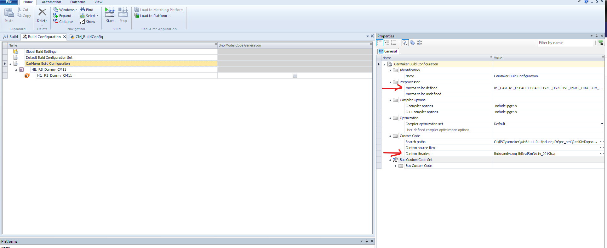

- set number of accepted overruns to be -1 in ConfigurationDesk:
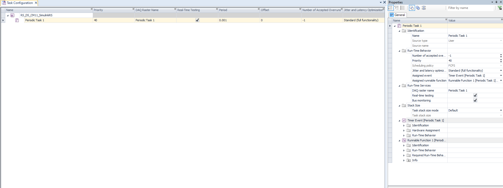

#### Additional instructions for RS Simulink libraries
**!!!The following steps are Optional and only needed if you are using RealSim Simulink blocks**
Need a simulink initialization file similar to below:
```matlab
%% define constants
curFilePath = fileparts(mfilename('fullpath'));
RealSimAppPath = fullfile(curFilePath,'..\RealSimApps\SumoIpg');
RealSimPath = fullfile(curFilePath,'..\RealSimRelease');
configFilename = fullfile(RealSimAppPath,'config_SUMO.yaml');

%% add path of RealSim tools
addpath(genpath(RealSimPath))

%% initialize RealSim for Simulink, read yaml file
[VehicleMessageFieldDefInputVec, VehDataBus, TrafficLayerIP, TrafficLayerPort] = RealSimInitSimulink(configFilename);
RealSimPara = struct;
RealSimPara.speedInit = 13.5; % initial speed of the ego vehicle when entering SUMO network
RealSimPara.tLookahead = 0.1; % use 0.1 for external control, recommend to use tLookahead >= 0.2 for SUMO driver
RealSimPara.smoothWindow = 1; % number of moving average data point, 1 essentially mean no moving average
```

Best practice is to call this function as ```InitFcn``` in your Simulink model 


- if use RealSim Simulink blocks in the simulink, need to setup dSPACE TCP connetions as the following screenshots. Please refer to the dSPACE ConfigurationDesk project RS_DS_CM11_SimulinkRS and Simulink model RS_DS_CM11_SimulinkRS.slx to see how the dSPACE and RealSim are set up. 
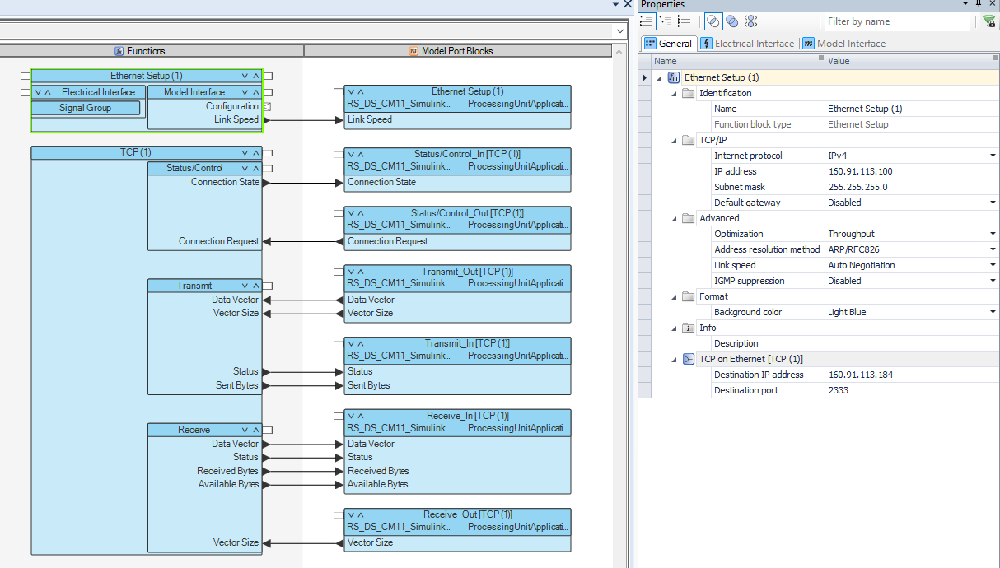
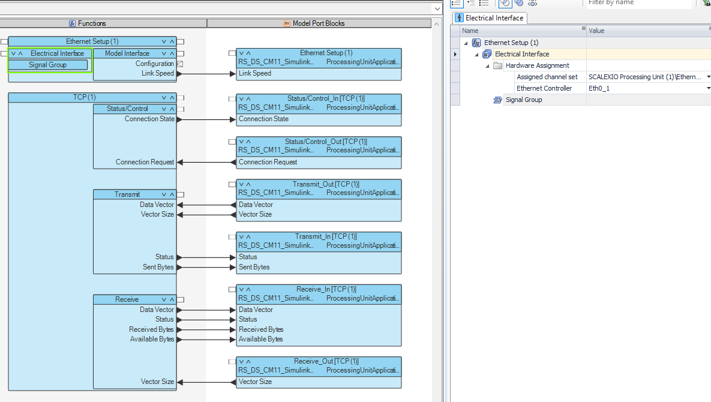
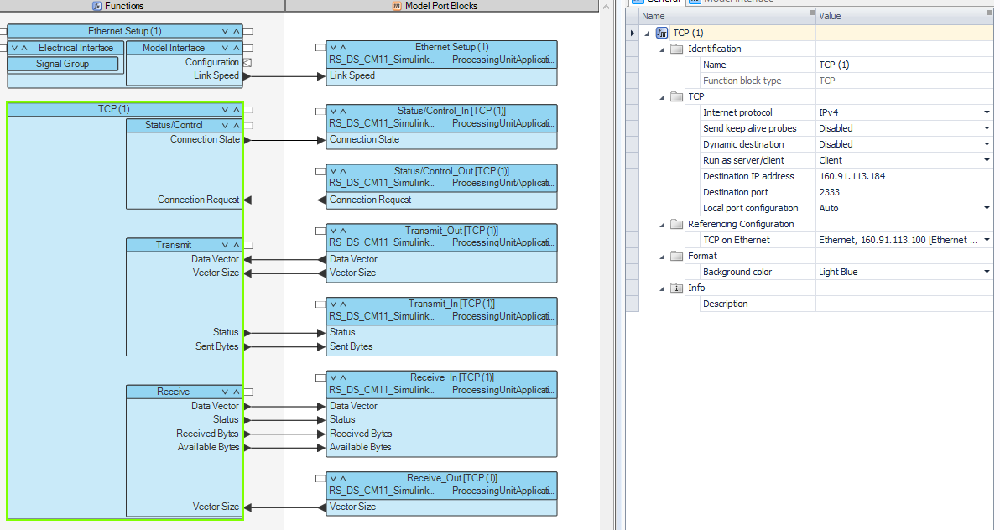
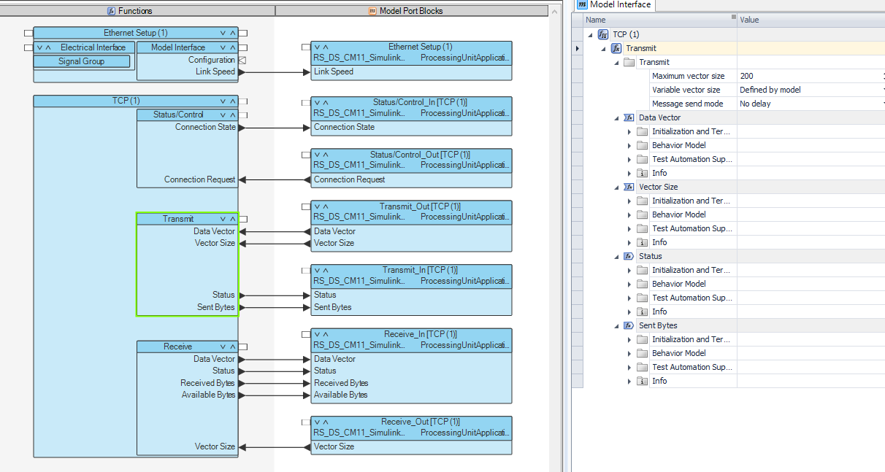
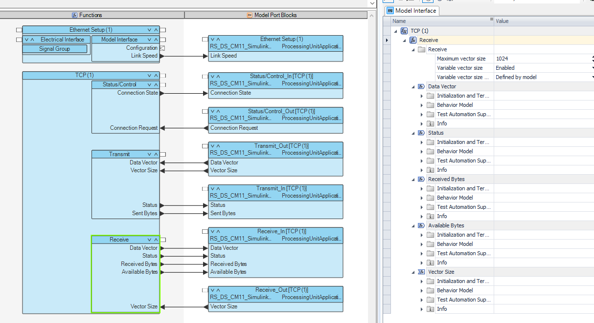

# Setup Application

## SUMO
The SUMO network files can be put at a different location than the RealSim folder and CarMaker folder. It is recommended to create a batch file for each different simulation runs and setups. This batch file can be inside the ##YOUR CM Project##\src_cm4sl folder or inside your SUMO network file folder. The corresponding path to RealSim, SumoApp, and CmProj need to be change accordingly. Also, example below runs the python script in a conda environment, it is up to the user to setup a python environment properly. The only non-standard python library is ```pyyaml```. Below is an example:
```batch
set RealSimPath=..\..\
set RealSimAppPath=.\sumoFiles
set configFilename=RS_config_release.yaml
set CmProjPath=..\..\CM11_proj

start sumo-gui -c %RealSimAppPath%\ShallowfordRd_RL.sumocfg --remote-port 1337 --step-length 0.1 --start --begin 39600

start cmd /c %RealSimPath%\TrafficLayer.exe -f %configFilename%

call conda activate realsimdev
python %RealSimPath%\CarMaker\RealSimSetCarMakerConfig.py --cm-project-path %CmProjPath% --configFile %configFilename% --signal-table-path %CmProjPath%\Data\Road\RS_ShallowfordRd_sumo_signal_RSsignalTable.csv
call conda deactivate

pause
```

# Run Simulations

## General Setups
**Generate Traffic Objects**

RealSimCarMakerSetup.py will modify an existing testrun file and add traffic objects to it. use ```RealSimCarMakerSetup.py --help``` to check all detailed arguments. Below is an example to read a "coordMerge_sumo" testrun and output a "coordMerge_sumo_rs_simulink" testrun with 10 cars and 10 trucks. Based on the version of testrun files, the script will search through CarMaker installation path and use existing vehicle .mobj files to create random traffic. ```RealSimCarMakerSetup.py --no-random-traffic``` can be set to disable random traffic, then all traffic objects will use the same vehicle. 
```
RealSimCarMakerSetup.py --cm-project-path ../CM10_Proj --testrun coordMerge_sumo --cm-install-path C:\IPG --output-testrun coordMerge_sumo_rs_simulink --car 10 --truck 10
```

After traffic objects are generated, **do not** modify their "Name" otherwise Real-Sim may not work properly. But feel free to modify the "Movie geometry" to another vehicle .mobj file. If SUMO vehicle is of vehicle class: "car", "passenger", "private", it will be rendered as a car in CarMaker. If SUMO vehicle is of class "truck", it will be rendered as a truck in CarMaker. All other vehicle classes are not currently supported. 

**Create lookup table to synchronize SUMO and IPG traffic signal lights**

- Currently, traffic signal lights have to be manually created in CarMaker. Each signal light should be associated with a traffic light controller in the Scenario Editor. This traffic light controller has to be named with the following convention
```
<SUMO TLS id>_<SUMO signal index>
```
Also, all timing of the traffic light controller should be set to ```0```, and initial phase to be ```off```. An example is shown below
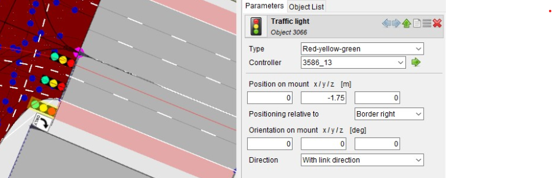
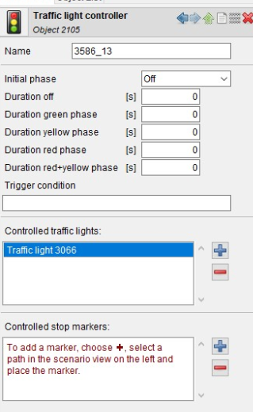

- Then, the same script above can take an additional argument to read a SUMO file and link the signal light between SUMO and IPG CarMaker:
```
RealSimCarMakerSetup.py --cm-project-path ../CM10_Proj --testrun coordMerge_sumo --cm-install-path C:\IPG --output-testrun coordMerge_sumo_rs_simulink --car 10 --truck 10 --sumo-file-path .\\tests\\SignalIpg\\sumoFiles\\ShallowfordRd_RL.net.xml

```
Then, a ```<SignalTable>.csv``` will be automatically created. By default, it will be in the ```CM11_proj\Data\Road``` folder. 


**Setup config.yaml**

All the settings are pretty much similar to other Real-Sim simulation setups. Here, the following "VehicleMessageField" are mandate, otherwise errors will pop up:
```id, speed, vehicleClass, heading, grade, speedDesired```.

There is a new configuration section called ```CarMakerSetup```. Inside it, users can name the ```EgoId``` as any string of length < 50. This will be the id of the ego vehicle appears in SUMO so should be unique than other SUMO vehicles. By default, ego vehicle will have type "DEFAULT_VEHTYPE" in SUMO. If user set ego vehicle as a vehicle type belongs to truck, then it will appear as truck in SUMO. Make sure to select the same type/class of vehicle in both SUMO and CarMaker. 

Below is an example ```CarMakerSetup``` section:
```yaml
CarMakerSetup:
    # whether or not enable CarMaker (default: false)
    EnableCosimulation: true
    
    # if true, ego state is sent from Simulink.
    # if false, ego state is sent from User.cpp 
    EnableEgoSimulink: false
    
    # Ip and Port settings 
    # if no setting, need to make sure have one and only one vehicle id subscription, which will be used as ip and port
    # if set, will use whatever set here instead of what is defined in subscription
    CarMakerIP: 160.91.113.184
    
    CarMakerPort: 7331
    
    # refresh rate, default Traffic Objects updates every 0.001 seconds
    TrafficRefreshRate: 0.001
    
    # ego settings
    # if no setting, need to make sure have one and only one vehicle id subscription, which will be used as ego
    # if no type, will add the vehicle using sumo default vehicle type
    # if set, will use whatever set here instead of what is defined in subscription
    EgoId: egoCm
    
    EgoType: DEFAULT_VEHTYPE

    # transmit real-time traffic signal light information 
    SynchronizeTrafficSignal: true

    TrafficSignalPort: 2444    
```
Note, in dSPACE implementation, CarMakerIP should be the IP of the host PC. 

## Office
Make sure select the compiled ```CarMaker.win64.exe``` and specify command line options to the desired config.yaml file 

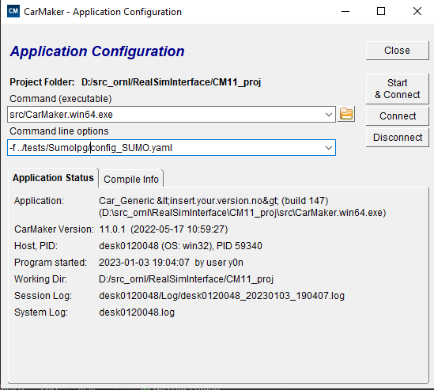

## Simulink

Make sure compiled libcarmaker4sl.mexw64 is in the search directory, which can be checked by ```which libcarmaker4sl.mexw64``` in Matlab. Then, specify command line options to the desired config.yaml file 

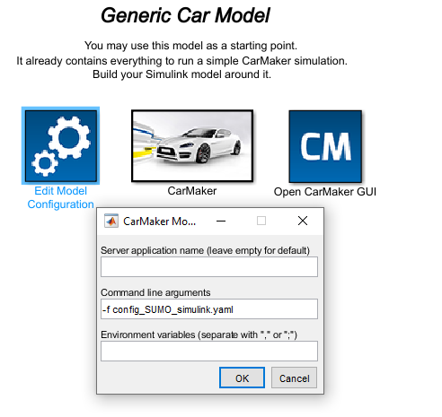

```CM11_proj\src_cm4sl\RealSimGeneric.mdl```  is a good example simulink model to develop user applications


## dSPACE
Following the previous setup steps, dSPACE should already be ready to run. 


## Examples
The release comes with a CM11_proj folder and example SUMO applications, and Visual Studio projects to compile executables. The SUMO files are inside ```tests``` folder. The testruns can potentially be transferred to previous CarMaker versions by manually changing testrun heading to the desired version, for example, 
```FileIdent = CarMaker-TestRun 11``` ==> ```FileIdent = CarMaker-TestRun 9```


<!---
## Office simulation
run SUMO and Real-Sim with ```runCoordMergeSUMO.bat```, use CarMaker testrun ```coordMerge_rs```, make sure the GUI configuration is set properly, check [Office](#office)

## Simulink simulation
run SUMO and Real-Sim with ```runCoordMergeSUMO_simulink.bat```, use CarMaker testrun ```coordMerge_rs_simulink```, use Simulink file ```CM11_proj\src_cm4sl\RealSimGeneric.mdl``` make sure the configuration is set properly, check [Simulink](#simulink).
-->

## dSPACE Simulation
1. Make sure the path of the variable ```RS_configFile``` in ```User.c``` is correct for your environment

2. Open the ConfigurationDesk project ```RS_DS_CM11_noSimulinkRS_useManeuver``` which is inside the ```CM11_proj/ConfigDesk``` folder. The simulink file is ```RS_DS_CM11_noSimulinkRS_useManeuver.slx``` under ```CM11_proj\src_cm4sl_ds```. Compile the ConfigurationDesk project. See more details in [this section](#setup-cm-dspace)

3. Start any of the SUMO applications that can be tested out of the box under ```tests``` folder.
	- **SignalIpg** which will demonstrate how the signal light is synchronized between SUMO-IPG-dSPACE. Modify the ```runShallowfordRd_release.bat``` to the correct path of your environment and execute it. 

	- **SumoIpg** will demonstrate how to setup CarMaker maneuvers to ramp up and ramp down for HIL applications, modify the ```runSumoIpg_release.bat``` to the correct path of your environment and execute it. 
4. Start CarMaker and select project ```CM11_proj```
	- **SignalIpg** selet testrun ```RS_Shallowford_sumo_signal```
	
	- **SumoIpg** selet testrun ```merge_RS_noSimulinkRS_useManeuver```
5. Start CarMaker simulation

Note, after compiling a Simulink model, you should be able to switch to different SUMO applications or CarMaker testrun without the need to recompile the Simulink. However, after 


	


